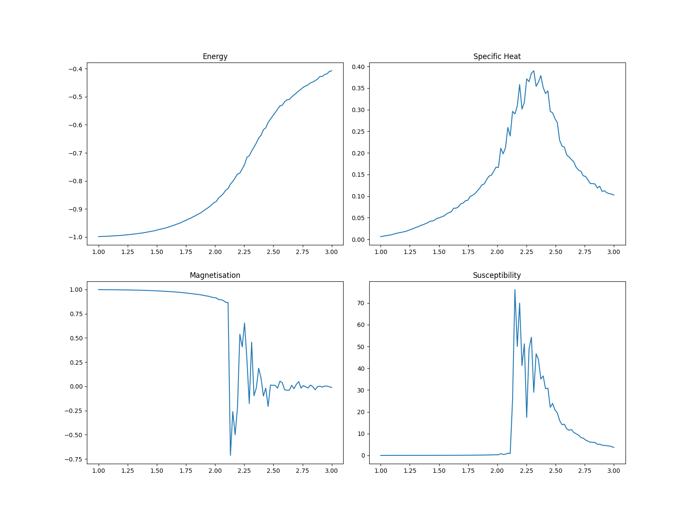
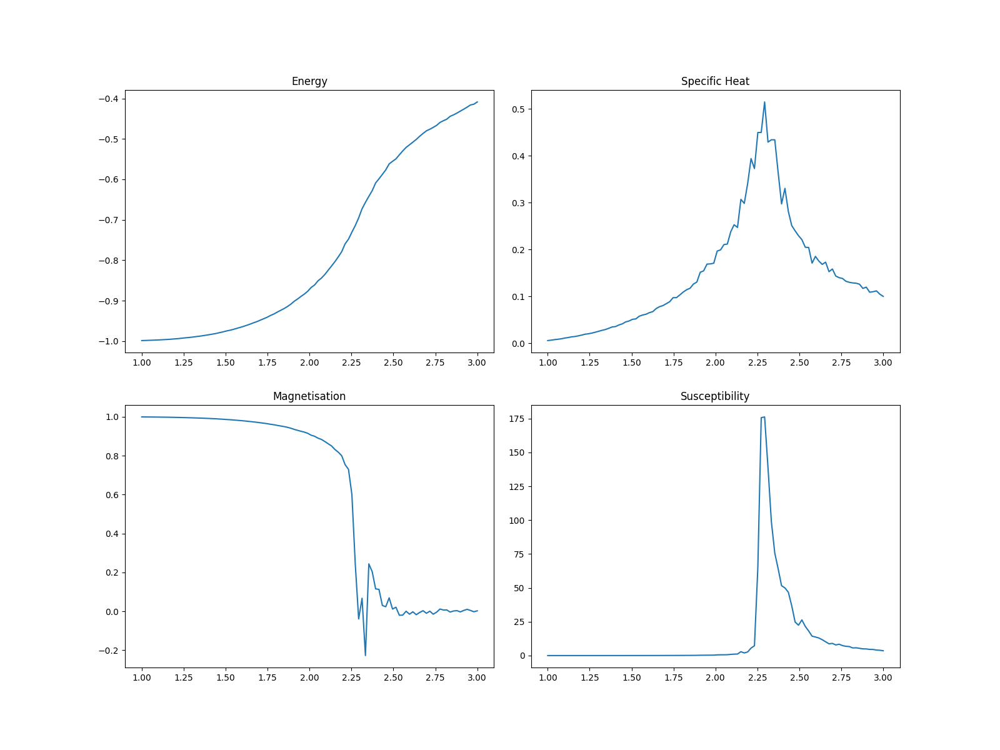
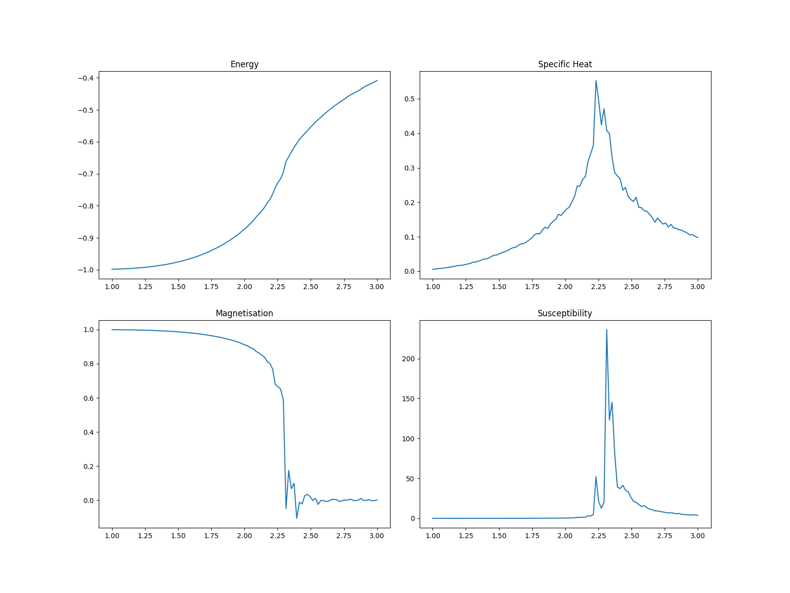
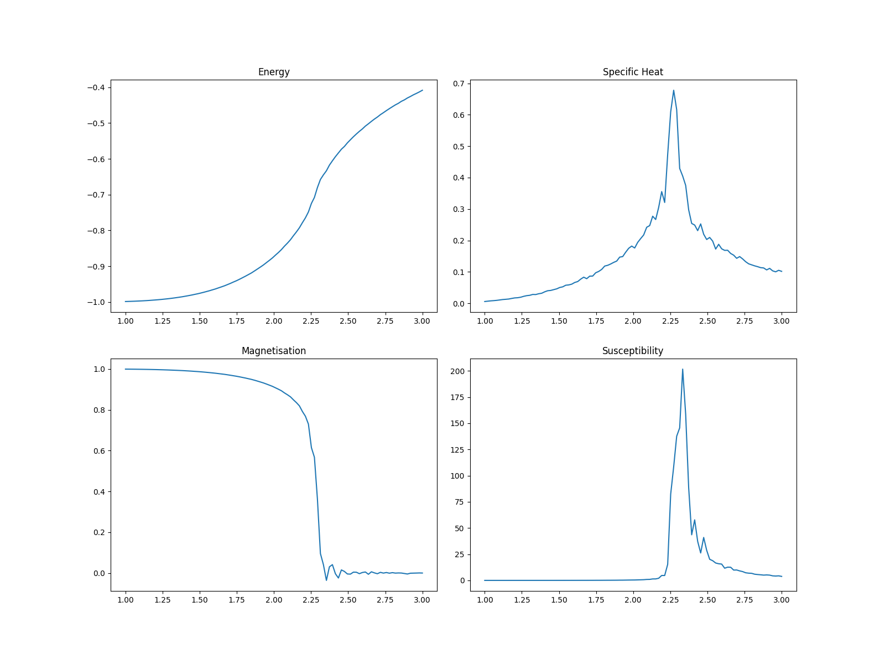
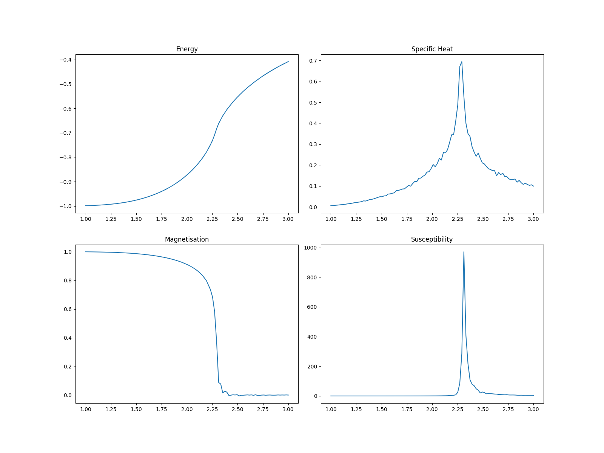

# NTMF021 - Ising Model

Simple 2D Ising Model simulation using MCMC (Metropolis-Hastings sweeping)

## Usage

Build using `make build` (requires g++ compiler, uses c++17 standard and fopenmp

Run using `make run` or directly run built executable.

When asked for filename provide name *only* (i.e. `ising128`, *not* `ising128.csv` *nor* `out/ising128.csv`)

To plot graphs, use `make plot name=[filename]`, where filename is the name of csv file in `out` directory
(eg. to plot file `out/ising128.csv` use `make plot name=ising128`)

## Results

### 16x16 Grid

### 32x32 Grid

### 64x64 Grid

### 128x128 Grid

### 256x256 Grid

